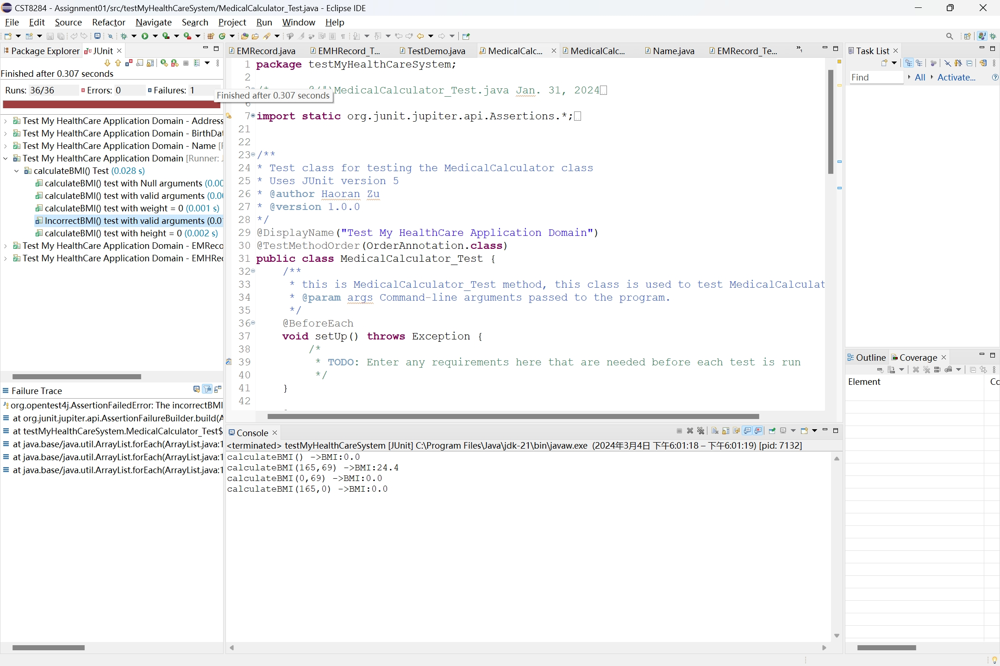

# myHealthCareSystem
✨ Build a health care system that can track Electronic Health Records of patients.
## Features
- Managed Records efficiently by capturing and processing patient data and facilitated the calculation of health metrics like BMI and heart rate.
- Wrote the test plan and implemented Java Unit (JUnit) Testing to test methods.
- Produced JavaDoc by providing meaningful comments for each method.
- Engineered the backend logic and utilized Java's exception handling to ensure robustness against erroneous inputs.

## UML Diagram

## JUnit Test
- Created JUnit test for all classes and provided Junit tests for each method in each class. 

- Also, Created a new method in the MedicalCalculator class named incorrectBMI(). In this method, calculate the BMI but deliberately introduce an error in the math. Use JUnit test for this method and it has a failure of this method .

## TestDemo
- Use the given data from the instruction and print all EMR from each patients.

